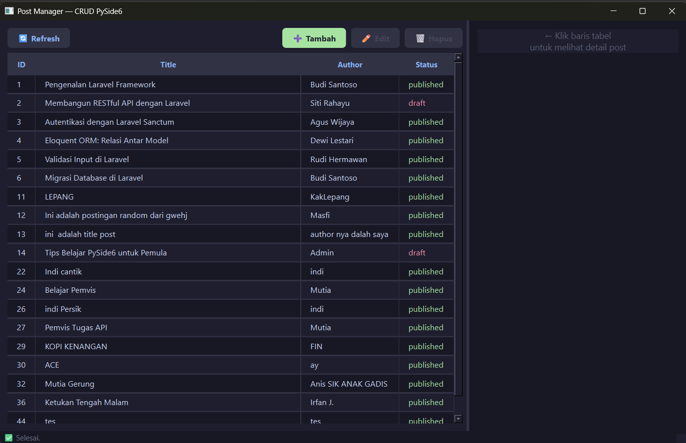

# T6-week11
Aplikasi Post Manager ini adalah aplikasi desktop berbasis PySide6 untuk mengelola data artikel (post). Aplikasi ini terhubung langsung ke API (https://api.pahrul.my.id/api/posts), sehingga semua data yang diinput bisa langsung tersimpan di database server. Di dalam aplikasi ini, pengguna bisa melakukan fungsi standar CRUD, yaitu melihat daftar postingan di tabel, mengklik baris untuk membaca detail dan komentarnya di panel sebelah kanan, serta menambah, mengedit, dan menghapus postingan lewat form yang sudah disediakan.

